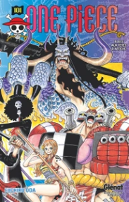
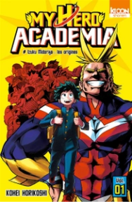
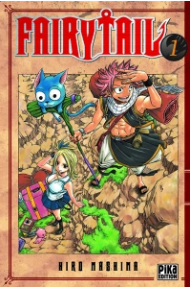
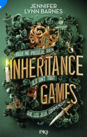
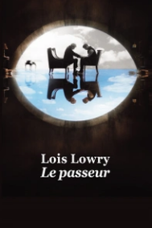
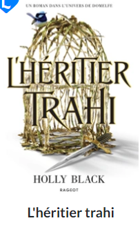
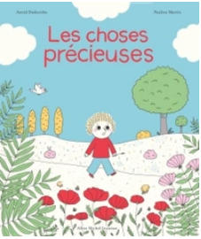
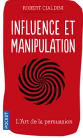
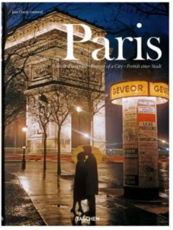
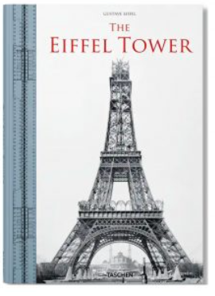

<html>
<head>
        <title>mm</title>
        <link rel="stylesheet"  href="https://cdnjs.cloudflare.com/ajax/libs/font-awesome/5.15.3/css/all.min.css" >
        
    </head>
    <body>
        <header>

            <input type="checkbox" id="toggler">
            <label for="toggler" class="fas fa-bars" ></label>
            <a href="#" class="logo">.Lire</a>
    
            <nav class="navbar">
               <a href="#1">Romans</a>
            <a href="#2" >Manges</a>
            <a href="#3" >histoire enfant</a>
            <a  href="#4" >développement personnel</a>
            <a  href="#5" >ART</a>
               
            </nav>
         
        

            
            
            
            
            
        
  
        </header>
        
        <h2 style="margin-top: 110px;">
<b>Manges</b>
</h2>
        

            

                
                <h2 class="h2">One Piece - Édition originale - Tome 101</h2>
                <h5 class="h5">Eiichiro Oda</h5>
                <h3 class="h3">Prix:170 MAD</h3>
                
 
                
                
                
                

           

           

            
            <h2 class="h2">My hero academia t1</h2>
            <h5 class="h5">Kohei Horikoshi</h5>
            <h3 class="h3">Prix:270 MAD</h3>
           
 
            
            
            
            

       

           

                
                 <h2 class="h2">Fairy Tail T01</h2>
                <h5 class="h5">Hiro Mashima</h5>
                <h3 class="h3">Prix:300 MAD</h3>
               
 
                
                
                
                

           

           
             
           

            <a href="m.html" target="_blank">
pour voir plus des livres
<button class="bouton">clique ici</button></a>

          

          
           
           

      
       <h2>
<b>Les Romans</b>
</h2>
       

        

            
            <h2 class="h2">Inheritance Games - tome 1</h2>
            <h5 class="h5">Jennifer Lynn Barnes</h5>
            <h3 class="h3">Prix:270 MAD</h3>
           
 
            
            
            
            

       

       

            
            <h2 class="h2">Le passeur</h2>
            <h5 class="h5">LOWRY, LOIS, Lois Lowry</h5>
            <h3 class="h3">Prix:170 MAD</h3>
           
 
            
            
            
            

       

       

            
            <h2 class="h2">L'héritier trahi</h2>
            <h5 class="h5">Holly Black</h5>
            <h3 class="h3">Prix:140 MAD</h3>
           
 
            
            
            
            

       

   
         

            <a href="r.html" target="_blank">
pour voir plus des livres
<button class="bouton">clique ici</button></a>

          

     

    
        
   <h2>
<b>histoire enfant</b>
</h2>
   

    

         
         <h2 class="h2">La Mouche qui pète</h2>
         <h5 class="h5">Michal Escoffier</h5>
         <h3 class="h3">Prix:270 MAD</h3>
        
 
         
         
         
         

    

   
    

         
         <h2 class="h2">les choses préceuses</h2>
         <h5 class="h5">Astrid Desbordes</h5>
         <h3 class="h3">Prix:190 MAD</h3>
        
 
         
         
         
         

    

    

         
         <h2 class="h2">Chevalier Chouette</h2>
         <h5 class="h5">Christopher Denise</h5>
         <h3 class="h3">Prix:210 MAD</h3>
        
 
         
         
         
         

    

    

        <a href="a.html" target="_blank">
pour voir plus des livres
<button class="bouton">clique ici</button></a>

      

   <h2>
<b>développement personnel</b>
</h2>
   

    
    

         
         <h2 class="h2">Influence et manipulation</h2>
         <h5 class="h5">Robert B. Cialdini</h5>
         <h3 class="h3">prix:150 MAD</h3>
        
 
         
         
         
         

    

    

         
         <h2 class="h2">La cle de votre energie</h2>
         <h5 class="h5">Natacha Calestrémé</h5>
         <h3 class="h3">prix:280 MAD</h3>
        
 
         
         
         
         

    

    

         
         <h2 class="h2">Père riche, père pauvre</h2>
         <h5 class="h5">Robert T. Kiyosaki</h5>
         <h3 class="h3">prix:190 MAD</h3>
        
 
         
         
         
         

    

    

        <a href="m.html" target="_blank">
pour voir plus des livres
<button class="bouton">clique ici</button></a>

      

<h2 style="margin-top: 110px;">
<b>ART</b>
</h2>

     
    

         
         <h2 class="h2">San Francisco – Portrait d’une ville</h2>
         <h5 class="h5">Reuel Golden</h5>
         <h3 class="h3">Prix: 650 MAD</h3>
        
 
         
         
         
         

    

    

        
        <h2 class="h2">Paris – Portrait d’une ville</h2>
        <h5 class="h5">Jean-Claude Gautrand</h5>
        <h3 class="h3">Prix:675 MAD</h3>
       
 
        
        
        
        

   

   

    
    <h2 class="h2">The Eiffel Tower </h2>
    <h5 class="h5">Bertrand Lemoine</h5>
    <h3 class="h3">Prix:390 MAD</h3>
   
 
    
    
    
    

    <a href="art.html" target="_blank">
pour voir plus des livres
<button class="bouton">clique ici</button></a>

  

<h1 style="margin-top: 20px; margin-left: 25%; margin-bottom: 15px;">Quels sont les meilleurs romans incontournables à lire ?</h1>

<per>   Si la notion de "meilleur livre" est complètement subjective et qu'elle varie d'un lecteur à un autre en fonction de ses goûts,
     de ses intérêts et de ses expériences personnelles, un ouvrage qualifié de "meilleur livre" répond, cependant, à un certain nombre de critères. En effet, le lecteur s'attend à plonger dans une histoire bien construire avec une intrigue prenante qui le tiendra en haleine jusqu'à la toute dernière page dans laquelle évoluent des personnages complexes et bien développés. En effet, les personnages doivent être crédibles, multidimensionnels et - surtout - de susciter l'empathie (ou l'antipathie) des lecteurs.
    
    Mais puisque les goûts et les couleurs sont propres à chacun, si un ouvrage se retrouve dans la catégorie "meilleur livre", 
    c'est avant tout parce qu'il aura été capable de marquer le monde littéraire, influencer d'autres auteurs ou encore avoir une signification 
    culturelle importante à une époque donnée. C'est pourquoi, en tenant compte de tous les goûts littéraires, nos libraires vous proposent
     des sélections diversifiées pour vous conseiller des ouvrages éclectiques, de tous les genres et qui ont su s'imposer comme des références
      solides au sein de la sphère littéraire.</per>
    
     
    
    <h1 style="margin-top: 20px; margin-left: 25%; margin-bottom: 15px;"> Comment choisir un livre à lire ?</h1>
     <per>Avant d'entamer le processus de sélection d'un livre à lire, n'oubliez pas qu'il n'y a pas de "mauvais" choix en matière de lecture,
         tout dépend de vos préférences personnelles et de vos intérêts. Voici quelques étapes qui pourraient vous aider à faire votre choix :
    
    Définissez vos intérêts : Que ce soit la science-fiction, le fantastique, les romans policiers, d’aventure ou même les livres de non-fiction,
     listez tous les genres de livres que vous pensez aimer.
    
    Considérez les auteurs : Si vous avez déjà lu et apprécié un livre d'un auteur, il pourrait être intéressant de chercher d'autres œuvres de
     ce même auteur.
    
    Faites des recherches : Consultez nos listes de recommandations de livres de nos libraires ainsi que leurs coups de cœur, lisez les critiques
     et les résumés pour vous faire une idée du contenu du livre.
    
    Pensez à votre niveau de lecture : Assurez-vous que le livre est approprié pour votre niveau de lecture. Un livre trop complexe ou trop simple
     pourrait ne pas vous captiver.
    
    Lisez quelques pages : Si possible, lisez sa quatrième de couverture et les premières pages du livre pour voir si le style d'écriture vous plaît.
    
    Chaque lecteur est unique, alors n'hésitez pas à suivre votre instinct et à choisir un livre qui vous attire vraiment.</per>

        </body>
</html>

       
